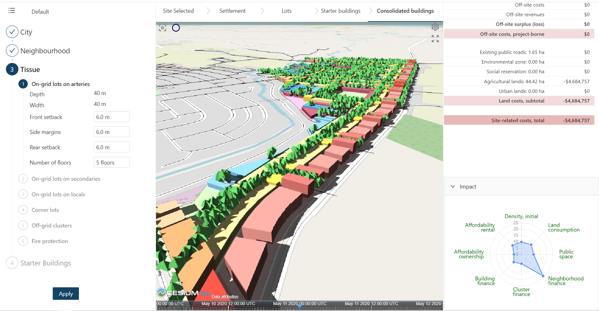

# Rapid Urbanism Explorer

The Rapid Urbanism Explorer is an Augmented Intelligence (AI) Platform to strengthen collaboration
amongst decision makers in developing new urban districts in advanced ways. Rapid iterative virtual
prototyping empowers stakeholders to produce complex urbanization scenarios integrating spatial,
temporal, socioeconomic and environmental parameters in real time. Further info on
[www.RapidUrbanism.com/Explorer-AI](www.RapidUrbanism.com/Explorer-AI).

## Rapid Urbanism Explorer Version 0.3

This is version 0.3 of RUE. This version is an early prototype of the software. 

This software is offered under the 
[MIT License](https://github.com/rapidurbanism/RUE03/raw/main/LICENSE).

[**Please read the terms and conditions of this software.**](Terms_of_Use.pdf)

RUE has been tested on the Chrome browser.

## Overview

The RUE explorer consist of two parts: a spatial model and a financial model.
- The spatial model starts with a site and uses a set of parametric scripts to generate a spatial
  model of the proposed development. The spatial model includes both the 3D geometry and a set of
  other data associated with that model.
- The financial model start with the data generated by the spatial model and calculates various
  metrics relating to economic and social viability of the project.

On the left hand side, the user enters a set of spatial parameter values that drive the spatial
model. Clicking the `Apply` button then updates the the spatial model, which in turn updates the
financial model.

The software is completely client-side. It does not perform any computation on the server. This
allows the software to be used anywhere, even in locations where Internet connectivity is poor. 

## Spatial Model

For the spatial models, RUE uses Mobius Modeller, a client-side parametric modelling software in the
browser.

The spatial model consist of four scripts:
- _City_: Generates the site polygon.
- _Neighbourhood_: Subdivides the site into a set of roads and partitions.
- _Tissue_: Subdivides partitions into lots.
- _Starter Buildings_: Generates 3D building massings on the lots.

The input parameters for the spatial model are shown on the left hand side. The tabs along the top
of the 3D viewer allow different model outputs to be shown. 

## Financial Model

For the financial models, RUE uses [LuckySheet](https://github.com/mengshukeji/Luckysheet), a
client-side spreadsheet.

In RUE 0.3, the financial model consist of multiple linked spreadsheet. Values from the spatial
model are inserted into specific cells in the spreadsheet, which then triggers the spreadsheet
calculations to be executed. 

The financial model was developed as a Microsoft Excel spreadsheet, and then converted into the
LuckySheet format. The Excel file was manually converted, by loading the file into an [online
LuckySheet application](https://mengshukeji.github.io/LuckyexcelDemo/). The data was then extracted
and incorporated into the RUE application. 

## Saving and Loading Simulations

The settings for a specific simulation can be saved and loaded as a RUE file (with a _.rue_
extension). 

The functionality is available under the three-bar menu button available in the top-left hand
corner.
- `New Simulation`: Start a new simulation.
- `Save Simulation`: Save the current simulation settings to a RUE file on your hard-disk.
- `Load Simulation`: Open previously saved simulation settings from a RUE file on your hard-disk.

## Site Definition

Version 0.3 of RUE includes three options for defining the project site. These are available under
the drop-down menu under `City > Site Definition`.
- VMC Site: Loads a default hard-coded site, to be used for demonstration purposes. This is the
  default option. 
- Load Site: Allows you to load a geojson file that specifies a custom site. See below for more
  information on the requirements of this site.
- Dummy Site: Create a simple quadrilateral site for testing and debugging, the same as the method
  used in version RUE 0.2.

## Geojson Input Files

The RUE03 scripts for generating spatial models are applicable to sites that run adjacent to an
main road. The main road is refer to as an `arterial` road. There may be zero or more `secondary`
roads, which are expected to run approximately perpendicular to the arterial road. 

The _City_ script require two Geojson files as inputs: the site file and the roads file. 
- The site file should contain just a single polygon. No attributes are required. One or more of the
  edges of the site polygon are expected to be adjacent to the arterial road defined in the roads
  file. 
- The roads file should contain a set of polylines, representing road centrelines. Two attributes
  are required: `road_type` and `road_pcent`
  - `road_type` is a string and can be either `art` indicating the arterial road, or `sec`
    indicating a secondary road. 
    - _Arterial road_ (`art`): There should only be one arterial polyline. The polyline will be used
      as the main axis for sub-dividing the site into blocks and partitions.
    - _Secondary roads_ (`sec`): There can be multiple secondary polylines. If these polylines cross
      the site, then they will be used to cut the site polygon into smaller polygons.
    - _Other roads_: Polylines that are neither `art` nor `sec` are assumed to be other roads, and
      are ignored.
  - `road_pcent` is number (a percentage between 0 and 100) that indicates the percentage of the
    road area to be attributed to the site. 0% indicates that the none of the road area falls within
    the site, 50% indicates that half the road falls within the site, and 100% indicates that the
    whole road falls within the site.

The site polygon and road polylines in the Geojson files need to be clean simple geometric objects.
The number of points used to define these geometric entities should be as few as possible.
(Geometric entities with many points very close together my cause errors or strange outcomes.)

## Framework

RUE is developed using the React framework, version 17. 

In this version, the Mobius files (with a _.mob_ extensions) are saved as Javascript files. The
Javascript files are then copied into RUE. The files contain a main function, which when executed
will generate both the spatial model and the spatial data.

The four Mobius Javascript files can be found in the folder `/src/components/models/` folder. The
input data, in the form of Geojson data, is also saved in the same folder. 

The Mobius Javascript files require various Mobius libraries. The
source code for these Mobius libraries can be found in the `/src/mobius/` folder.

The spatial models are generated in the Mobius `GI` format. These models are subsequently visualised
as 3D models in a Mobius viewer, which is embedded within RUE in an _iframe_ html component. RUE
communicates with the Mobius viewer using a simple `post-messsage` API. The API allows RUE to load
the different models, depending on the tab that is selected at the top of the viewer. 

For this version of RUE, Mobius Modeller version 0.6 was used. 
* [Mobius Modeller 0.6](https://design-automation.github.io/mobius-parametric-modeller-dev-0-6/)

When this version of RUE was develop, the LuckySheet library was not yet available on the NPM
package manager. The source code for LuckySheet was therefore included, under the
`/public/luckysheet/` folder.

## Installation and Build

To install, change to root folder, then:
`npm install`

To init credentials:
`amplify init`

To start dev server:
`npm start`

## Direct Dependencies

The two main dependencies are:
- Mobius Modeller: https://github.com/design-automation/mobius-parametric-modeller-dev-0-6
- LuckySheet: https://github.com/mengshukeji/Luckysheet

A list of direct dependencies were extracted using 
[NPM license crawler](https://www.npmjs.com/package/npm-license-crawler), as follows:
- `npm-license-crawler- --onlyDirectDependencies --csv libs.csv`

See [the output CSV file](libs.csv).

The website links for the dependencies are as follows:
- https://github.com/ant-design/ant-design-charts
- https://github.com/ant-design/ant-design-icons/tree/master/packages/icons-react
- https://github.com/antvis/data-set
- https://github.com/aws-amplify/amplify-js
- https://github.com/gsoft-inc/craco
- https://github.com/Doodle3D/clipper-js
- https://github.com/formulajs/formulajs
- https://github.com/gregberge/loadable-components
- https://github.com/testing-library/jest-dom
- https://github.com/testing-library/react-testing-library
- https://github.com/testing-library/user-event
- https://github.com/DefinitelyTyped/DefinitelyTyped
- https://github.com/ant-design/ant-design
- https://github.com/aws-amplify/amplify-js
- https://github.com/ant-design/babel-plugin-import
- https://github.com/alibaba/BizCharts
- https://github.com/gka/chroma.js
- https://github.com/omichelsen/compare-versions
- https://github.com/FormAPI/craco-less
- https://github.com/cytoscape/cytoscape.js
- https://github.com/d3/d3-delaunay
- https://github.com/d3/d3-polygon
- https://github.com/d3/d3-voronoi
- https://github.com/eligrey/FileSaver.js
- https://github.com/Stuk/jszip
- https://github.com/webpack-contrib/less-loader
- https://github.com/less/less.js
- https://github.com/josdejong/mathjs
- https://github.com/streamich/memfs
- https://github.com/mobxjs/mobx-react
- https://github.com/mobxjs/mobx
- https://github.com/BenjaminVanRyseghem/numbro
- https://github.com/proj4js/proj4js
- https://github.com/react-csv/react-csv
- https://github.com/facebook/react
- https://github.com/supremetechnopriest/react-idle-timer
- https://github.com/goldenyz/react-perfect-scrollbar
- https://github.com/ReactTraining/react-router
- https://github.com/facebook/create-react-app
- https://github.com/facebook/react
- https://github.com/styled-components/styled-components
- https://github.com/mrdoob/three.js
- https://github.com/Microsoft/TypeScript
- https://github.com/jashkenas/underscore

